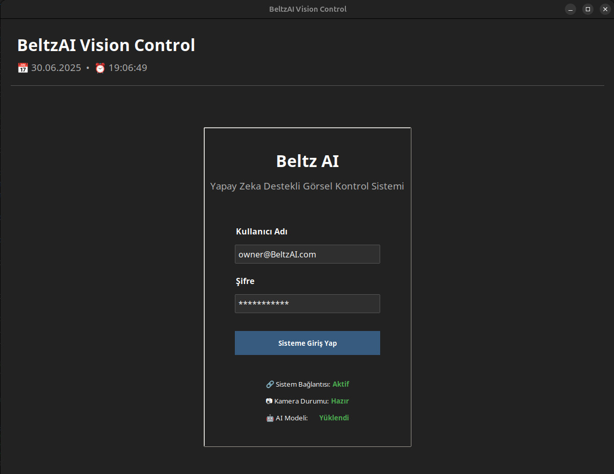
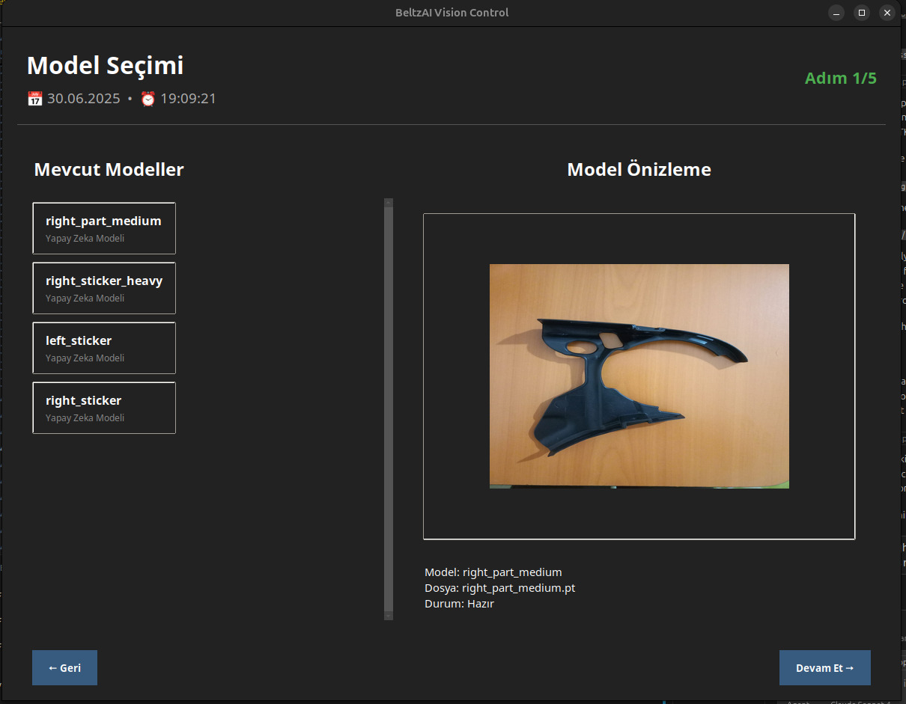
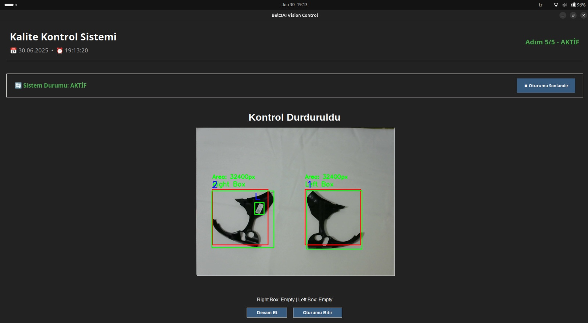

# 📦 Industrial Object Detection and Operation Assessment - Desktop Application

This repository contains the desktop application component of the "Industrial Object Detection and Operation Assessment on Conveyor Belt" project. This application is a crucial part of the machine vision system, designed for real-time monitoring, object detection, and placement validation on industrial conveyor belts.

---

## Table of Contents

- [Introduction](#introduction)
- [Features](#features)
- [System Architecture](#system-architecture)
- [Installation and Setup](#installation-and-setup)
- [Usage](#usage)
- [Screenshots](#screenshots)
- [Future Work](#future-work)
- [License](#license)
- [Contact](#contact)

---

## Introduction

In modern manufacturing, precision and efficiency are paramount. This desktop application addresses the critical need for accurate part placement on conveyor belts, minimizing errors and optimizing production workflows. It leverages advanced machine vision techniques to monitor operations, verify placement accuracy, and provide immediate feedback to operators.

This application is designed for on-site operation, offering low-latency inference with GPU support and a simplified operator interface, making it an essential tool for maintaining production quality and reducing waste in dynamic industrial environments.

## Features

The desktop application provides the following key functionalities:

-   **Real-Time Object Detection**: Integrates trained YOLOv8 models to detect predefined objects (e.g., parts, boxes) in real-time from live video streams.
-   **Multi-Object Tracking**: Utilizes YOLO's built-in tracking algorithm to maintain consistent object identities across frames, enabling time-based analysis and interaction history.
-   **Part Comparison via Template Matching**: Verifies correct object placement by comparing detected parts against predefined reference templates using a template matching algorithm, ensuring visual similarity and correct object-box associations.
-   **Video Stream Analysis**: Captures and processes frames from connected cameras in real-time using OpenCV, supporting continuous monitoring.
-   **Graphical User Interface (GUI)**: Provides a clean and intuitive interface built with Tkinter, allowing operators to:
    -   Monitor live camera feeds.
    -   View detection overlays (bounding boxes and labels).
    -   Track performance with real-time counters for correctly and incorrectly placed items.
    -   Receive immediate visual feedback on detection events.
-   **Local Data Storage**: Stores detection results and operational logs locally for historical analysis and synchronization.
-   **Error Handling**: Gracefully handles camera disconnections, model loading failures, and network connectivity losses, providing clear error messages and recovery options.

## System Architecture

The desktop application is a core component of the Machine Vision Module.

-   **Object Detection**: YOLO models (ultralytics YOLO) for part and box identification, with real-time inference and GPU acceleration support.
-   **Object Tracking**: YOLO's `track` function for multi-object tracking and ID consistency across frames.
-   **Video Processing**: OpenCV for frame capture, video codec support, and real-time processing.
-   **User Interface**: Tkinter for the desktop GUI, including real-time video display, counter widgets, and status indicators.

## Installation and Setup

1.  **Clone the Repository**:

    ```bash
    git clone https://github.com/bedirhanaksoy/beltzai-desktop-app.git
    cd beltzai-desktop-app
    ```

2.  **Create and Activate Environment (On Linux)**:

    ```bash
    uv venv
    source .venv/bin/activate
    ```

3.  **Install Dependencies**:

    ```bash
    uv sync
    ```

4.  **Download Trained Models**:
    *   Download pre-trained models and place them in the `./models` directory.

5.  **Camera Setup**:
    *   Ensure your industrial cameras are properly connected and configured on your system.

## Usage

1.  **Launch the Application**:

    ```bash
    python main.py
    ```

2.  **Model Selection**:
    *   On the "Model Selection Page," choose the appropriate trained YOLO model for your operation.

3.  **Base Image Creation (if applicable)**:
    *   Follow the on-screen tutorial to capture base images for object comparison and template matching.

4.  **Start Session**:
    *   Initiate the real-time detection session. The application will display live camera feeds with detection overlays.

5.  **Monitor Operations**:
    *   Observe the real-time video, object bounding boxes, and counters for correctly/incorrectly placed items.
    *   Warnings for incorrect placements will be displayed.

6.  **Stop Session**:
    *   Click the "Stop Session" button to end the current monitoring session.

## Screenshots

### Desktop App Main Page



### Model Selection Page



### Base Image Creation Page for Objects


### Detection of Misplaced Part



## Future Work

Potential future enhancements for the desktop application include:

-   **Improved Tracking and Counting Logic**: Further refining algorithms to handle overlapping objects and complex edge cases more effectively.
-   **Enhanced Error Detection**: Minimizing false positives and improving reliability under diverse industrial conditions.
-   **Scalability**: Optimizing the application to support more factories.

## License

This project is licensed under the Non-Commercial Software License (NCSL) v1.0.

You may use, copy, modify, and distribute this software **only for non-commercial purposes**.

Commercial use by anyone other than the copyright holder (BeltzAI) is strictly prohibited without prior written permission.

See the [LICENSE](./LICENSE.md) file for full details.

## Contact

For any inquiries or support, please contact:

-   [ATAKAN KURT](https://github.com/a-kurt)
-   [BEDIRHAN ÖMER AKSOY](https://github.com/bedirhanaksoy)
-   [MURAT ERBILICI](https://github.com/ThoRight)

Gebze Technical University, Computer Engineering Department, 2025.
